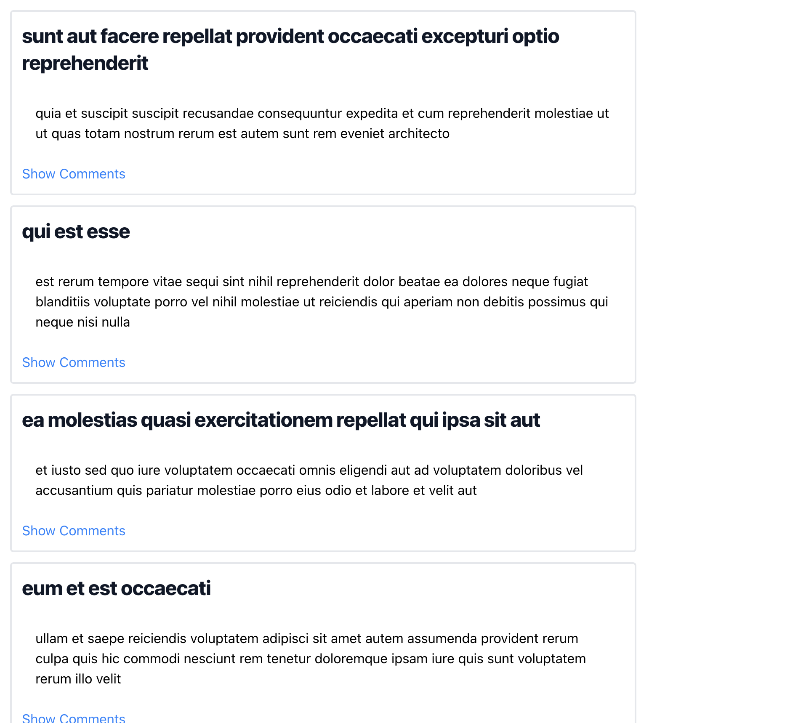
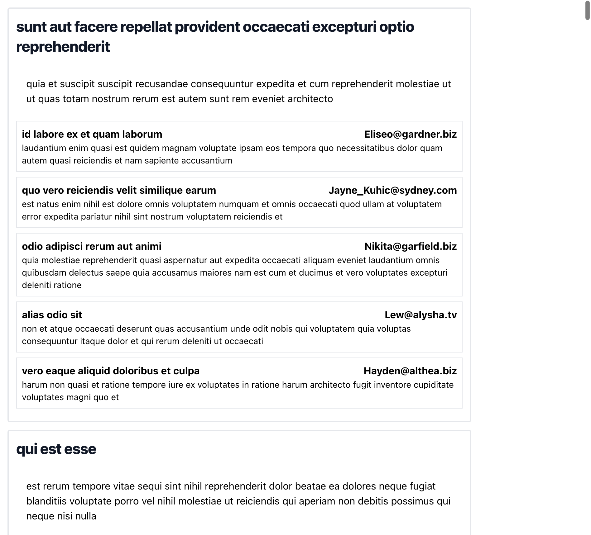
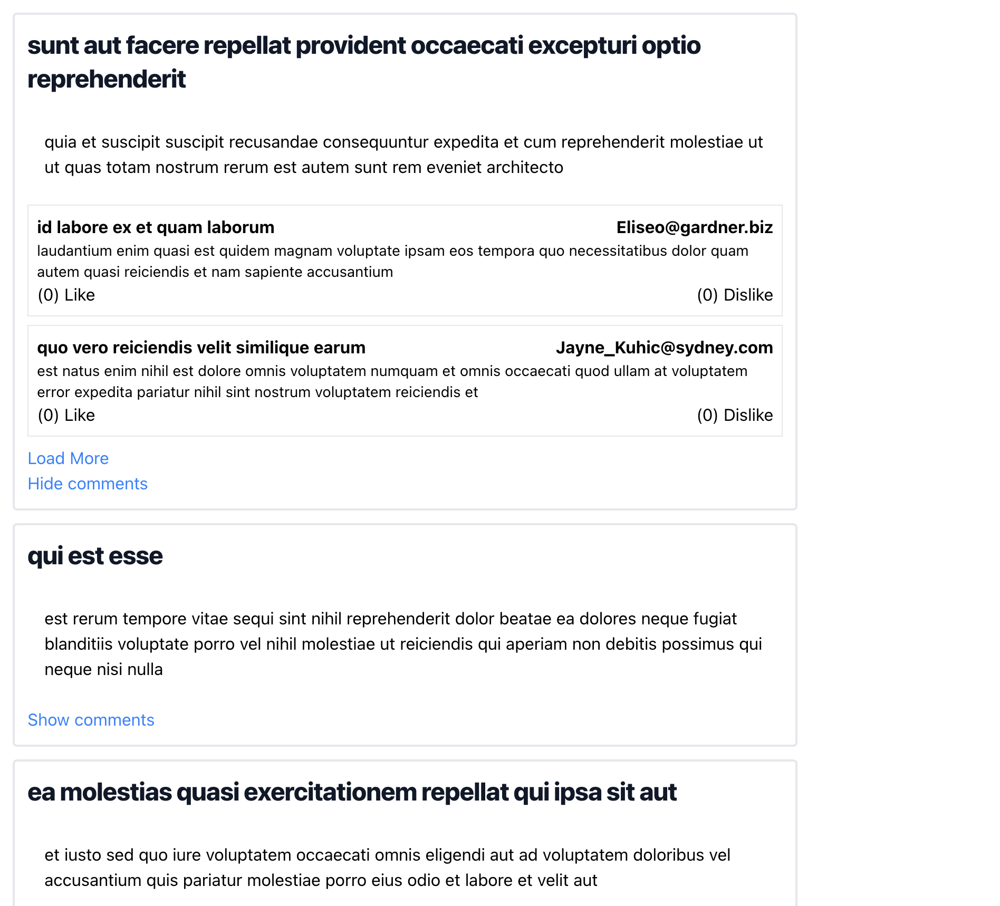

# Step 1 

Render all posts. Create "Show comments" button at the end of each post. 

Design:

# Step 2 

"Show comments" functionality. 

Renders all comments under the post.

Design:

# Step 3 

Like & Dislike functionality.

User can't like and dislike the post at the same time. Like negates dislike and vice versa. 

Deisgn: 

# Step 4

Limit the amount of comments shown. Default about should be 2. 

Load comments functionality. User can load more comments by pressing "Load more comments".

# Step 5 

Reply to a comment. Nest comment under the parent comment. 

No deisgn. Go nuts, bonus step.
