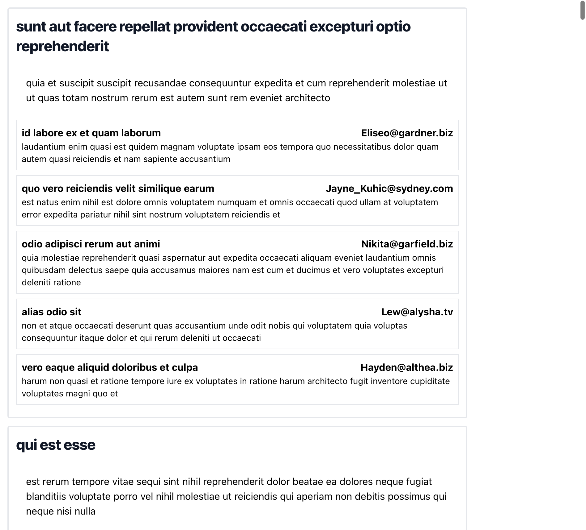

# Step 1 

Render all posts and a show comments button. 

Design:

# Step 2 

"Show comments" functionality. Renders all comments under the post.

Design:

# Step 3 

Like & Dislike functionality 

When like is pressed dislike has to be reseted for the user, and vice versa for the dislike button.

Deisgn: 

# Step 4

Limit amounnt of comments shown by default to 2. Load more comments by pressing "Load more comments" by 2 comments.

# Step 5 

Reply to a comment. Nest comment under the other comment.

No deisgn. Go nuts, bonus step.